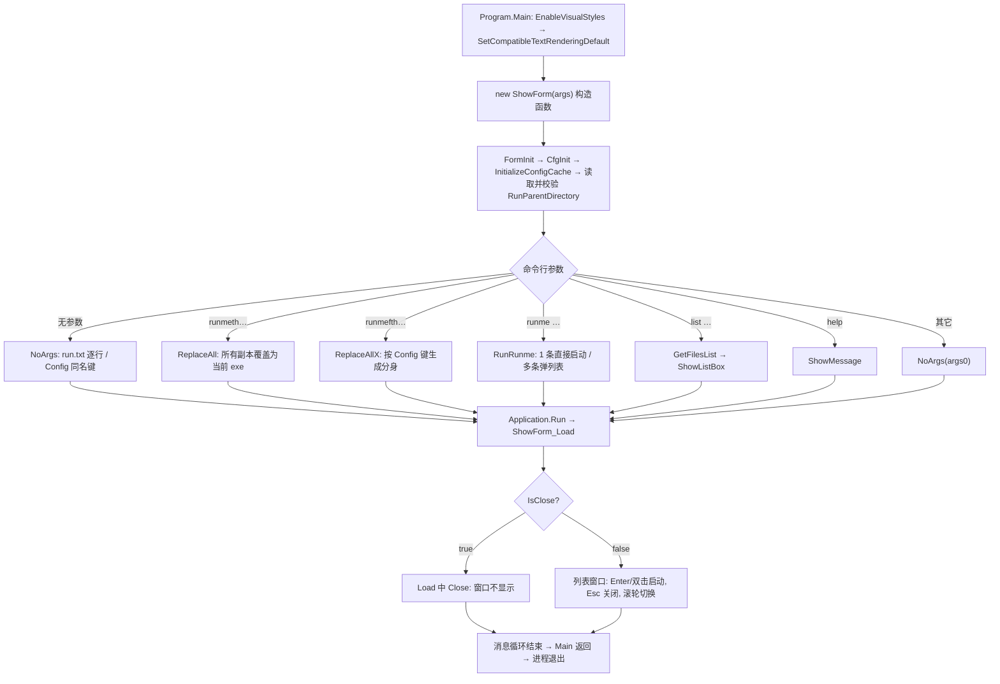

# RunMe 项目文档

> 整理日期：2026-09-13 ｜ 适用工程：`RunMe.sln`（C# / .NET Framework 4.7.2 / WinForms / WinExe）
> 本文档基于源码走读整理，描述程序**从启动到结束**的完整运行顺序与行为。

## 目录

- [1. 项目概述](#1-项目概述)
- [2. 源码结构与职责](#2-源码结构与职责)
- [3. 从启动到结束的完整运行顺序](#3-从启动到结束的完整运行顺序)
  - [阶段 1：进程启动](#阶段-1进程启动)
  - [阶段 2：构造函数初始化](#阶段-2构造函数初始化)
  - [阶段 3：命令分发](#阶段-3命令分发)
  - [阶段 4：显示窗体与交互](#阶段-4显示窗体与交互)
  - [阶段 5：启动外部程序](#阶段-5启动外部程序)
  - [阶段 6：退出](#阶段-6退出)
- [4. 命令行分支总表](#4-命令行分支总表)
- [5. 配置文件 YanBinCfg.ini](#5-配置文件-yanbincfgini)
- [6. 占位符与路径解析规则](#6-占位符与路径解析规则)
- [7. 整体流程图](#7-整体流程图)
- [8. 缺陷修复记录](#8-缺陷修复记录)
- [9. 回归测试](#9-回归测试)

## 1. 项目概述

RunMe 是一个"**单 exe 多身份**"的程序启动器（Windows 窗体程序）：

- 程序靠**自身 exe 文件名**（`RunExeName`，去掉 `.exe`）在配置文件中查找要执行的内容；
- 同目录的 `YanBinCfg.ini` 是唯一的数据来源（不存在时自动生成一份带示例的默认配置）；
- 通过"命令行参数"或"无参数 + 配置"两种方式决定行为；
- 正常执行（启动目标程序）后自身立即退出；**只有需要从列表选择时才显示窗口**。

**核心用法（改名即用）**：把 `RunMe.exe` 改名为入口名（如 `Vs.exe`）→ 在 `[Config]` 中配置同名键 → 双击分身启动目标程序。命令行参数（`runme` / `list` 等）与 `run.txt` 是附加能力。

典型流程：

1. 把 `RunMe.exe` 复制/改名成许多"分身"（如 `Vs.exe`、`Nug1.exe`、`工具甲.exe`）；
2. 在 `[Config]` 节中按分身名写明要启动的程序；
3. 运行分身（双击）→ RunMe 按文件名查配置 → 启动真正的目标程序。

## 2. 源码结构与职责

| 文件 | 职责 |
| --- | --- |
| `Program.cs` | 程序入口 `Main`：启用视觉样式 → 运行 `ShowForm` |
| `ShowForm.cs` | 全部业务逻辑：配置读取、参数分发、列表窗口、进程启动 |
| `RunMe.csproj` | 工程定义（`WinExe`、`.NET Framework 4.7.2`、`StartupObject=RunMe.Program`） |
| `App.config` | 运行时配置（仅声明支持的 .NET 运行时版本） |
| `YanBinCfg.ini`（随 exe） | 运行时配置数据库（`Settings` / `Config`） |
| `Properties/*` | 程序集信息、资源与设置（当前逻辑未使用） |

## 3. 从启动到结束的完整运行顺序

### 阶段 1：进程启动

1. 运行 `RunMe.exe [参数...]`，进入 `Program.Main(string[] args)`；
2. `Application.EnableVisualStyles()`：启用视觉样式；
3. `Application.SetCompatibleTextRenderingDefault(false)`：设置文本渲染默认值；
4. `Application.Run(new ShowForm(args))`。

> 注意：`ShowForm` 的**构造函数先完整执行**（可能已经启动了外部进程、或决定要弹列表），然后才进入窗体消息循环。

### 阶段 2：构造函数初始化

1. `FormInit()`：
   - `IsClose = true`（"执行完就关"的默认值）；
   - 窗口宽 `402`、初始高 `48`、标题"很牛B的一个程序启动器"、注册 `Load` 事件；
   - `RunExePath` = 自身所在目录（`AppDomain.CurrentDomain.BaseDirectory`，带尾部 `\`）；
   - `RunExeName` = 自身 exe 文件名去掉 `.exe`；
   - `YanBinCfgPath` = `RunExePath` + `YanBinCfg.ini`。
2. `CfgInit()`：若 `YanBinCfg.ini` 不存在 → `CreateIniFile()` 生成默认配置（UTF-8 带 BOM）。
3. `InitializeConfigCache()`：把 ini 逐行解析成 `Config[节][键]=值`
   - 空行、`#`/`;` 开头行跳过；节、键均**不区分大小写**；值取**第一个** `=` 之后的全部内容。
4. 读取 `[Settings] RunParentDirectory` 作为相对路径的基准目录；
   - 若 `RunParentDirectory` / `RunExeName` / `RunExePath` 任一为空 → 直接 `return`（`IsClose` 仍为 `true`，后面 Load 时关窗退出）。

### 阶段 3：命令分发

按以下顺序判断，**命中即执行**：

> 说明：原 `[ExecProcess]`、`[ExecAdminProcess]` 两节均已移除——普通命令模板写在 `[Config]`；管理员权限改用命令中 `runadmin` 标记表达（与 cmd/ps 顺序任意，见阶段 5）。

**3.1 命令行参数分支**

| `args[0]` 条件 | 行为 | 之后 |
| --- | --- | --- |
| 无参数 | `NoArgs()`：见 3.2 | 启动 / 弹列表 / 退出 |
| 以 `runmeth` 开头 | `ReplaceAll()`：目录（非递归）中除自身外所有 `*.exe` 删除并复制为自身 | 静默退出 |
| 以 `runmefth` 开头 | `ReplaceAllX()`：先删除所有非自身 exe；再按 `[Config]` 各节（跳过 `Settings`）的**键**批量生成 `键.exe` 分身（已存在则不覆盖） | 静默退出 |
| `runme`（独立词或引号整串） | 取出 `runme` 之后的全部内容交给 `RunRunme`；无内容则 return | 启动 / 弹列表 |
| `list`（独立词或引号整串） | `list 扩展名 [目录]`：目录可省略（默认 exe 所在目录），列出目录文件 → `ShowListBox()` | 弹列表 |
| 等于 `help`（忽略大小写） | `ShowMessage()`：弹消息框显示完整用法说明 | 用户确认后退出 |
| 分身自身在 `[Config]` 有配置、参数非上述命令 | `NoArgs()`：执行分身自身配置，参数供 `{0}` 填充或追加 | 启动 / 弹列表 |
| 其它 | `NoArgs(args[0])`：把首个参数当作"程序名/配置键" | 启动 / 退出 |

**3.2 `NoArgs(rname)` 流程**

- `rname` 缺省为 `RunExeName`；
- 若 `{rname}run.txt`（如 `RunMerun.txt`）存在 → `RunFileContent()`：按 UTF-8 逐行读取，**每行 `Sleep(1000)` 后**依序 `WinExec(行内容)`（延迟批量启动）；
- 否则查 `[Config]` 中键名 `rname` 的值：
  - 值以 `runme ` 开头 → `RunRunme(值)`（列表：单条直接启动 / 多条弹列表）；
  - 否则 → `WinExec(值)`（整条按单条命令执行，即使含逗号）。

**3.3 `RunRunme(字符串)` 流程**

- 参数开头的 `runme` 标记（后跟一个空格，如 `runme A|aa.exe,…`）会被剥离（兼容配置值与命令行两种来源）；
- 按 `,` 拆成多个条目；每段按 `|` 拆成 `显示名|目标`，`目标` 经 `ProcessPath()` 解析（会先查一层 `[Config]` 别名；`cmd`/`ps`/`runadmin`/`show` 前缀命令与裸命令词不做路径解析）；
- 结果存入 `RunDict`：
  - **恰好 1 条** → `WinExec(该条)`：直接启动，不弹窗；
  - **多条** → `ShowListBox()`：弹列表等待选择；
  - 0 条（无效内容）→ 最终静默退出（无提示）。

### 阶段 4：显示窗体与交互

`Application.Run()` 开始消息循环，窗体首次显示时触发 `ShowForm_Load`：

- `IsClose == true`（没有任何"弹列表"请求）→ `Close()`：**窗口根本不出现**，消息循环立即结束；
- `IsClose == false`（`ShowListBox()` 已构建列表）→ 列表框获得焦点、默认选中第 1 项，等待用户操作：
  - **`Enter`** → 启动选中项（按住 **`Shift`** 则管理员启动），并关窗；
  - **`Esc`** → 关窗（不启动任何程序）；
  - **双击** → 启动选中项，并关窗；
  - **鼠标滚轮** → 循环切换选中项（不启动）。

列表框窗口外观：宽 `402`、高 = `48 + 48 × 条目数`（上限 `800`）、屏幕居中、字体微软雅黑 26.25。

### 阶段 5：启动外部程序

真正干活的是私有方法 `WinExec(string upath, bool runas = false)`，处理顺序：

1. **全局占位符替换**：`{time.*}` / `{env.*}` / `{guid.*}` / `{random.*}`（cmd/ps 命令同样生效）；
2. **参数填充**：值含 `{0}{1}…` → 用命令行参数填充（不足补空格、多余忽略）；否则处于"带参数运行分身/模板"场景时，把参数追加到命令尾部；
3. **执行标记解析**：从命令开头逐个取词——`runadmin` → 置管理员标志；`show` → 置显示窗口标志；`cmd` → 记录 CMD 外壳；`ps`/`powershell` → 记录 PowerShell 外壳；标记词顺序任意（`runadmin cmd xxx`、`cmd show xxx`、`runadmin ps xxx`、`ps runadmin xxx`），直到首个非标记词即为命令体；
4. 外壳为 `cmd` → `CmdExec(命令体, 管理员标志, 显示窗口标志)`：`cmd.exe /c 命令体`，工作目录 = `RunExePath`：
5. 外壳为 `ps`/`powershell` → `PowerShellExec(命令体, 管理员标志, 显示窗口标志)`：命令按 UTF-16LE 编码成 Base64，以 `powershell.exe -NoLogo -NoProfile -EncodedCommand <Base64>` 执行；
6. 无外壳标记 → `ProcessString(命令体, false)` 拆出"程序 + 参数"（引号配对优先，其次 `.exe` 后跟空格，再其次"首个裸命令词 + 空格"）→ `ProcessPath()` 解析路径（标记词开头的目标直接放行，见第 6 节）→ `StartProcess()`：
   - **带参数** → `Process.Start(程序, 参数)`；`runas` 时附加 `Verb="runas"`（触发 UAC）；
   - **不带参数且非管理员** → 裸命令直接启动；带路径目标交给 `explorer.exe` 打开（文件夹、网址、文档均可"打开"）；
   - **不带参数且管理员** → 直接以管理员启动该程序；
   - 启动失败**静默吞掉**（仅 `Console.WriteLine`，无弹窗）。

> 备注：`runadmin` 与 cmd/ps 顺序任意——`runadmin cmd xxx`、`cmd runadmin xxx`、`ps runadmin xxx` 均以管理员权限启动对应外壳；无外壳标记则直接以管理员启动目标程序（触发 UAC）。

> 备注：控制台窗口**默认不显示**（cmd / ps / 命令行均静默执行）；命令开头加 `show` 一词才显示窗口（`show cmd xxx`、`cmd show xxx`）；提权（`runadmin`）时受 Windows 限制窗口总会显示。

### 阶段 6：退出

- 主窗体关闭 → `Application.Run()` 返回 → `Main` 返回 → **RunMe 进程退出**；
- 被启动的外部程序独立运行，不受影响（`UseShellExecute = true`）。

## 4. 命令行分支总表

| 命令行写法 | 效果 |
| --- | --- |
| `RunMe.exe`（无参数） | 读 `RunMerun.txt`，否则查 `[Config]` 中 `RunMe` 键 |
| `RunMe.exe 其它文本` | 把该文本当作"程序名/配置键"交给 `NoArgs(args[0])` |
| 以 `runmeth` 开头 | 目录内所有 exe 用自身覆盖（统一版本） |
| 以 `runmefth` 开头 | 按 `[Config]` 的键批量生成 exe 分身 |
| `runme 显示名\|目标,...`（独立词或引号整串均可） | 1 条直接启动；多条弹列表选择 |
| `list 扩展名 [目录]`（独立词或引号整串均可） | 列目录中指定后缀的文件供选择（目录缺省 exe 所在目录） |
| `help` | 弹用法说明 |

> `cmd …` / `ps …` / `runadmin …` / `show …` 等执行前缀**只在配置文件的值（含列表条目目标）与 `run.txt` 行中生效**；直接作为命令行首词传入不会触发。

## 5. 配置文件 YanBinCfg.ini

- 位置：与 exe 同目录，文件名**固定**为 `YanBinCfg.ini`；
- 首次运行自动生成默认内容（含注释与示例）；
- 语法：`[节]` + `键=值`；忽略空行与 `#`、`;` 开头的行；节与键**不区分大小写**；值 = 第一个 `=` 之后的全部内容。

| 节 | 用途 |
| --- | --- |
| `[Settings]` | `RunParentDirectory`：相对路径基准目录（默认 exe 目录）；`ExcludeExeName`：`list` 模式排除的文件名列表（默认 `RunMe\|MeRun`）；还可任意定义"变量名=值"，供 `{env.变量名}` 引用 |
| `[Config]` | 键 = 名字/分身名，值 = 单条命令（整条直接执行），或 `runme 显示名\|目标,…` 列表（以 `runme` 开头；单条直接启动、多条弹列表）；命令中可写 `runadmin` / `show` 标记（与 cmd/ps 顺序任意） |

## 6. 占位符与路径解析规则

**占位符**（正则要求花括号内含一个 `.`）：

| 占位符 | 含义 | 备注 |
| --- | --- | --- |
| `{time.格式}` | 当前时间按指定格式输出 | 格式非法则原样保留 |
| `{env.变量名}` | 读 `[Settings]` 中同名键的值 | 不是真实的环境变量 |
| `{guid.id}` | 生成新 GUID | 花括号内以 `guid.` 开头即可，后缀忽略 |
| `{random.最小-最大}` | 生成闭区间随机整数 | 支持负数；最小 > 最大时自动交换 |
| `{0}` `{1}`… | 命令行参数占位（所有配置值可用；带参数运行分身/模板时填入） | 不足补空格、多余参数丢弃 |

**路径解析**（`ProcessPath()`，基准目录 = `[Settings] RunParentDirectory`）：

| 前缀/形式 | 处理 |
| --- | --- |
| `X:\...` | 绝对路径，原样返回 |
| `http...` | URL，原样返回 |
| 以 `cmd` / `ps` / `powershell` / `runadmin` 开头（后跟一个空格） | 命令原样返回，不做路径解析（含标记词组合，如 `cmd runadmin xxx`） |
| 裸命令词（无分隔符、无扩展名，如 `dotnet`、`git`） | 原样返回，交给系统按 PATH 查找 |
| 配置中已有的键名 | 先查 `[Config]` 替换为对应值（仅一层，不递归） |
| `AppData...` | 基于当前用户 AppData 的上级目录（即 `C:\Users\用户名`） |
| `..\` 或 `../` | 逐级上溯基准目录 |
| `pf\...` | 依次在 C: ~ G: 的 `Program Files` 下查找存在的文件 |
| `pf86\...` | 同上，查 `Program Files (x86)` |
| 其它相对路径 | 与基准目录 `Path.Combine` 拼接（绝对路径不拼接，见表格首行） |

**特殊执行前缀**（作用于配置文件值（含列表条目目标）/ `run.txt` 行）：

| 前缀 | 效果 |
| --- | --- |
| `cmd 命令` | `cmd.exe /c 命令` |
| `ps 命令` / `powershell 命令` | 命令转 Base64 后以 `-EncodedCommand` 执行 |
| `runadmin 目标` | 命令开头写 `runadmin` 一词即以**管理员**权限执行，与 cmd/ps 顺序任意（`runadmin cmd xxx`、`cmd runadmin xxx`、`ps runadmin xxx`），触发 UAC 确认 |
| `show 目标` | 显示控制台窗口；**默认不显示**（与 cmd/ps 顺序任意：`show cmd xxx`、`cmd show xxx`）；提权时窗口总会显示 |

## 7. 整体流程图



## 8. 缺陷修复记录

> 2026-09-13 已全部修复，源码同步更新。

| # | 问题 | 修复方式 |
| --- | --- | --- |
| 1 | `runme` / `list` 的前缀匹配带空格，导致标准命令行写法无法命中 | 改为同时兼容独立词（`runme xxx`）与引号整串（`"runme xxx"`）；`list` 的目录参数改为可省略（默认 exe 所在目录） |
| 2 | `{guid.id}` 永不生效 | 判断由 `Equals("guid.")` 改为 `StartsWith("guid.")`，现可正常生成（后缀忽略） |
| 3 | `kernel32` 的 `WinExec` 声明是死代码 | 已删除该 `DllImport` 声明与无用 using，统一使用私有方法 `WinExec(string, bool)`（内部为 `Process.Start`） |
| 4 | `{random.}` 负数范围解析失败、短时间内随机值重复 | 改用正则 `^(-?\d+)-(-?\d+)$` 解析；最小 > 最大时自动交换；随机数改用共享 `RandomPicker` 实例 |
| 5 | 空值行（`键=`）抛异常并中断整份配置解析 | 改用 `IndexOf('=')` 切分，允许空值；解析异常改为写入 `Debug.WriteLine`（仍不打断程序） |
| 6 | `list` 目录不存在时未处理异常崩溃 | `GetFilesList` 增加目录存在性检查（不存在弹提示并返回），文件枚举包在 `try/catch` 中 |
| 7 | 列表窗口双击空白处空引用 | `ListBox1_DoubleClick` 判空 `SelectedItem`；`ListBox1_MouseWheel` 对 `SelectedIndex < 0` 先选中第一项 |
| 8 | `README.md` 描述与实现不一致 | README 已重新整理：删除不存在的右键菜单/后台线程描述，修正前缀与示例，并加入指向本文档的链接 |

**2026-09-13 第二批增强（统一执行能力）**：

1. 配置值开头的 `runme` 标记（后跟空格）自动忽略——列表显示名不再带前缀；
2. 占位符 `{time.*}` / `{env.*}` / `{guid.*}` / `{random.*}` 在所有执行路径生效（含 cmd/ps 命令）；
3. `{0}{1}…` 对所有配置值生效：带参数运行分身（如拖拽文件到 exe 上）时自动填入；
4. `cmd` / `ps` / `powershell` 前缀在 `[Config]`（含列表条目目标）同样可用，且不再被路径解析破坏；
5. 裸命令（`dotnet`、`git`、`notepad`…）按系统 PATH 直接执行；
6. 分身带参数运行：exe 名在 `[Config]` 有配置时直接执行自身配置并填入/追加参数；无配置时保持"参数当配置键"的原有行为；
7. `help` 弹窗内容更新为完整用法说明；
8. 已**移除 `[ExecProcess]` 支持**：命令模板统一写在 `[Config]`（迁移方式：把原条目原样移到 `[Config]` 即可）。

**2026-09-13 第三批小改进**：

1. `cmd` / `ps` / `powershell` 前缀支持管理员提权；
2. `runmeth` / `runmefth` 的文件删除与复制增加容错（被占用文件跳过、不中断）；
3. `{程序名}run.txt` 首行立即执行（仅行与行之间间隔 1 秒）；
4. 文件名去扩展名统一改用 `Path.GetFileNameWithoutExtension`（避免 `.exe` 子串误替换）；
5. 执行 `cmd`/`ps` 命令时保留原始空格（不再拆分重拼）；
6. `list` 模式的 `ExcludeExeName` 匹配改为忽略大小写；
7. `Program.Main` 增加全局异常兜底（不再弹 .NET 崩溃对话框，改为友好提示/记录）；
8. 清理：`region` 命名、`ShowListBox` 死分支、`ReplaceAllX` 孤立分号；测试脚本函数名改用批准动词（消除 PSScriptAnalyzer 提示）。

**2026-09-13 第四批（管理员权限统一为 `runadmin` 前缀）**：

1. 已**移除 `[ExecAdminProcess]` 支持**：管理员权限改为在命令中写 `runadmin` 一词（配置文件值、列表条目目标、`run.txt` 行均可用）；
2. `runadmin` 与 `cmd` / `ps` 顺序任意（`runadmin cmd xxx`、`cmd runadmin xxx`、`runadmin ps xxx`、`ps runadmin xxx`）；无外壳标记则直接以管理员启动目标；
3. 由 `WinExec` 解析命令开头的标记词序列并置管理员标志；`ProcessPath` 对以标记词开头的目标透传（列表条目不误做路径解析）；
4. 迁移方式：原 `[ExecAdminProcess] pc=…` → `[Config] pc=cmd runadmin …`。

**2026-09-13 第五批（控制台窗口显示控制）**：

1. 新增 `show` 标记：命令开头写 `show` 一词才显示控制台窗口，与 cmd/ps 顺序任意（`show cmd xxx`、`cmd show xxx`）；`ProcessPath` 对其透传（列表条目可用）；
2. **默认行为变更**：cmd / ps / 直接启动的控制台命令默认**不显示窗口**（`CreateNoWindow`）；GUI 程序与“打开目录/URL”不受影响；
3. 管理员提权（`runadmin`）时受 Windows 限制窗口仍会显示；
4. `StartProcess` 默认改为无 shell 方式启动（`UseShellExecute=false`），`show` 或提权时恢复 shell 方式。

**2026-09-13 第六批（列表标记语义修正）**：

1. 配置值的列表判断改为**以 `runme` 标记为准**：值以 `runme ` 开头 → 列表（`显示名|目标,…`，单条直接启动 / 多条弹列表）；不带 `runme` → 整条按单条命令执行；
2. 修复此前“值含 `,` 即按列表”会误伤含逗号单条命令（如 `cmd echo a,b>file`）的问题；
3. 命令行 `runme 显示名|目标,…` 用法不变；`RunRunme` 中的 `runme` 剥离逻辑保留（兼容两种来源）。

## 9. 回归测试

`docs/run-tests.ps1` 提供 29 项端到端冒烟测试，覆盖：无参数启动、`runme` 单条/多条（含列表显示名验证、cmd 前缀与占位符、**单条直接运行不弹列表**）、`list`（含目录缺省）、`help`、单 exe 多身份、占位符 `{guid.id}` / `{time.*}` / `{random.*}`、`{0}` 参数填充、`ps` 前缀、裸命令（PATH）、`{name}run.txt` 批量执行、首启生成带注释默认配置、**列表条目 cmd/ps 前缀选中即执行**、管理标记解析（纯标记无命令体不执行）、含逗号单条命令按单条执行、**窗口显示控制（默认隐藏 / `show` 显示，按可见控制台窗口数断言）**、`runmeth` / `runmefth`、异常目录不崩溃等。

```powershell
powershell -NoProfile -ExecutionPolicy Bypass -File docs\run-tests.ps1
```

脚本在 `%TEMP%\RunMeTest` 沙盒中运行（复制分身 exe + 生成测试用 ini），通过让目标命令写文件、读取窗口标题与列表框内容（Win32 `LB_GETTEXT`）来断言结果；全部通过时退出码为 0。

> 说明：读取列表项时需按类名前缀匹配（WinForms 的 ListBox 类名为 `WindowsForms10.LISTBOX...`，而非原生 `ListBox`）。

> `runadmin` 前缀涉及 UAC 确认，无法在无人值守环境端到端断言；其标记解析后的执行路径与 cmd/ps/路径用例相同，已被既有用例覆盖（测试 22 断言默认配置含 `runadmin` 示例）。

> 测试提示：`cmd`/`ps` 目标以异步子进程方式启动，断言其产物（如重定向文件）**必须轮询等待**（`Wait-File`），不能在主进程退出后立即检查。
